README - Projet Événements & Co

1. 🌟 Présentation du projet
Nom du projet : Événements & Co
Description courte : Site vitrine pour une agence d'organisation d'événements (mariage, anniversaire, soirée).
Objectif du site : Présenter les services de l'agence et permettre aux visiteurs de consulter les détails et de contacter facilement.
Public cible : Particuliers cherchant à organiser un événement privé (familles, couples, jeunes adultes).

2. 🔹 Structure du site
Pages incluses :
index.html (Accueil)
programme.html (Programme)
contact.html (Contact)
Fonctionnalités principales :
Navigation fluide entre les sections
Formulaire de contact statique
Ancrages internes vers les détails des services
Responsive design (mobile, tablette, desktop)
Technologies utilisées :
HTML5
CSS3 (via Bootstrap 5)
Bootstrap

3. 🌈 Design et maquettes
Le site a été conçu avec une attention particulière portée à l’esthétique et à l’expérience utilisateur.
🎨 Thème & inspiration : Couleurs douces et élégantes, ambiance festive et chaleureuse.
🔠 Police utilisée : Poppins, intégrée via Google Fonts.

🛠️ Outils de conception :
– Figma : pour les maquettes visuelles haute fidélité
– Balsamiq : pour les wireframes basse fidélité

 🎨 Palette de couleurs principale utilisées dans le site :

| Utilisation                          | Couleur (Hex)  | Description                            |
|--------------------------------------|-------------- -|--------------------------------------- |
| Arrière-plan général                 | `#FFF5F7`      | Rose très clair (doux et lumineux)     |
| Titres principaux (h2)               | `#C2185B`      | Rose fuchsia foncé (pour attirer l'œil)|
| Texte principal                      | `#333333`      | Gris foncé (lecture confortable)       |
| Liens actifs / boutons interactifs   | `#f06428`      | Orange vif (accents dynamiques)        |
| Boutons secondaires clairs           | `#FFE3EC`      | Rose pâle (boutons secondaires)        |
| Sections avec fond rose              | `#f7cfd0`      | Rose pastel (fond de section)          |
| Pied de page (copyright)             | `#dc868e`      | Rose moyen (fond du footer)            |
| Focus accessibilité (clavier)        | `#FF9900`      | Orange contrasté (contour focus)       |

4. 📖 Instructions d'installation
Le site est développé en HTML/CSS et utilise également le framework Bootstrap pour la mise en page et le design responsive.
Aucune installation n’est nécessaire.
Pour le visualiser :
🔹 Ouvrez simplement le fichier index.html dans un navigateur web (Chrome, Firefox, etc.).

5. 🚀 Hébergement
Le site est hébergé en ligne via GitHub Pages
Lien : 

6. 🛠️ Outils utilisés

- [WebAIM Contrast Checker](https://webaim.org/resources/contrastchecker/)  
  Vérification du contraste entre texte et arrière-plan.

- [Toptal CSS Minifier](https://www.toptal.com/developers/cssminifier)  
  Minification du CSS pour améliorer les performances du site.

---

7. 📊 Résultats Lighthouse

Des tests ont été réalisés pour évaluer la performance, l’accessibilité et les bonnes pratiques du site. Voici les résultats obtenus :

### ✅ Accueil - version mobile

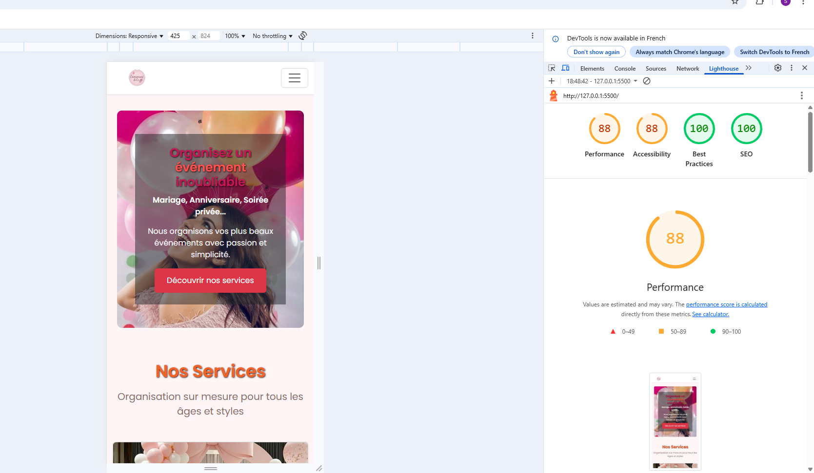

### ✅ Accueil - version desktop

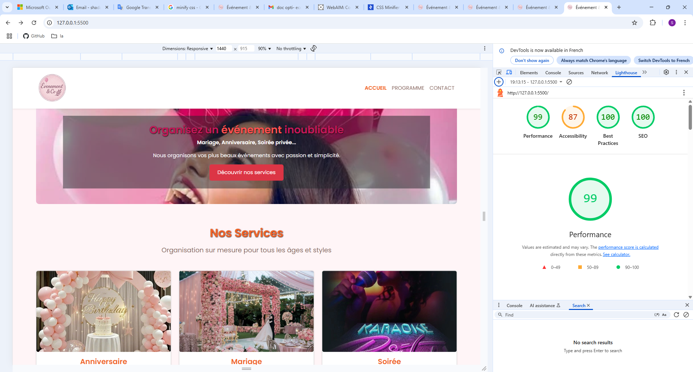

### ✅ Programme - version mobile

### ✅ Programme - version desktop

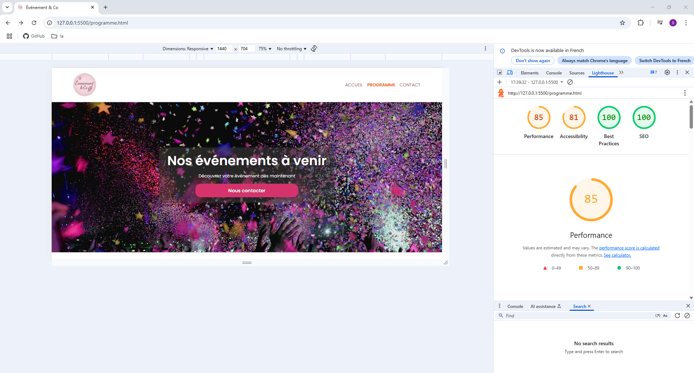

### ✅ Contact - version mobile

### ✅ Contact - version desktop

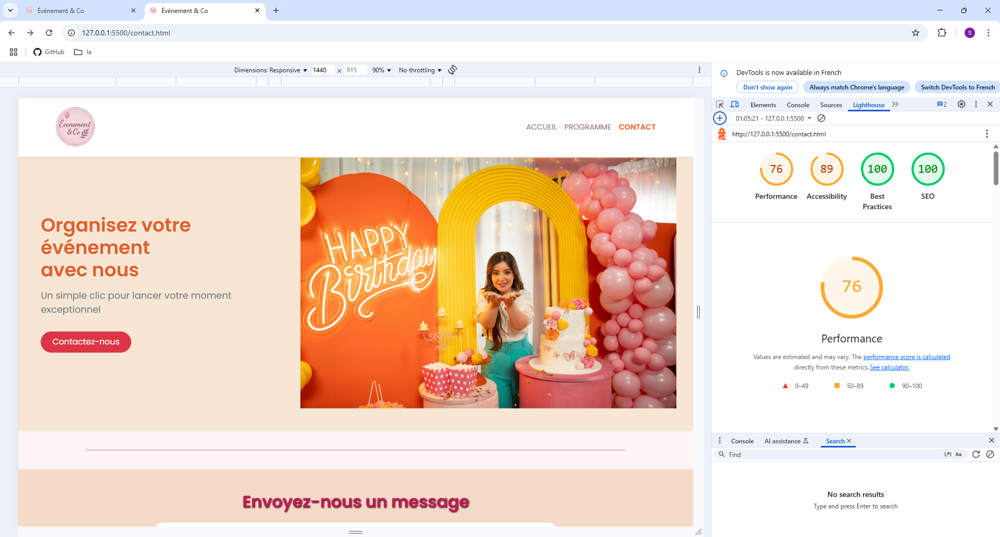

### 🧩 Maquette Figma - Accueil

## 🧩 Maquettes du projet

Voici les maquettes utilisées pour concevoir le site "Événement & Co".

### 🔷 Figma
La maquette haute-fidélité a été réalisée avec [Figma](https://www.figma.com/).  
Elle représente la version visuelle finale du site.

📎 Capture d’écran de la maquette Figma :
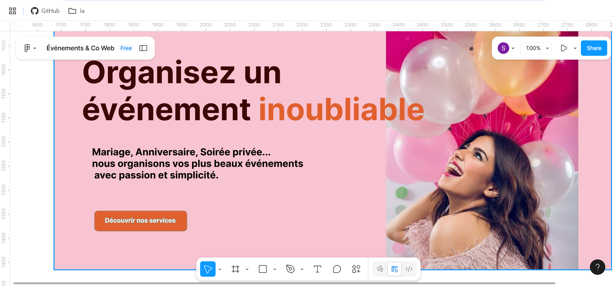 
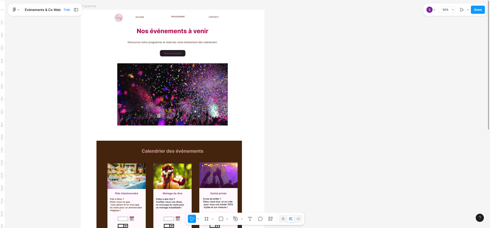 
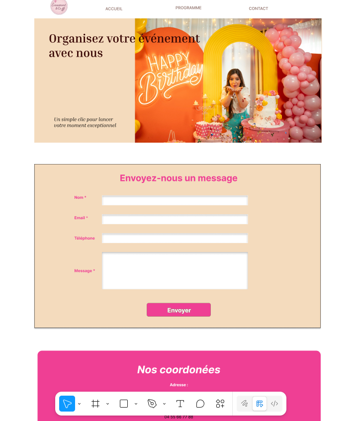 

### 🔳 Balsamiq
Une maquette basse-fidélité a été réalisée avec **Balsamiq Wireframes**, pour visualiser l'organisation des pages avant le développement.

📎 Captures des wireframes Balsamiq :
- Accueil : 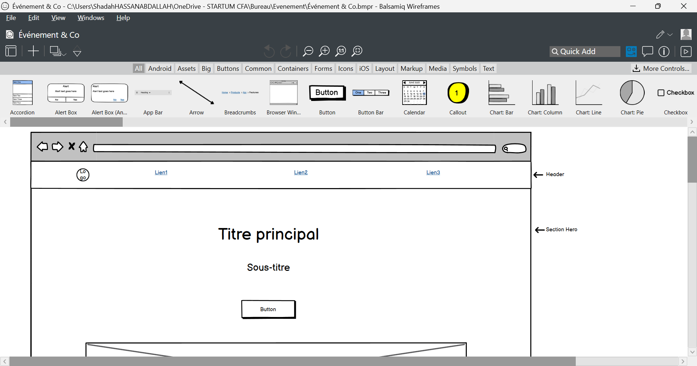
- Accueil : 
 Programme : 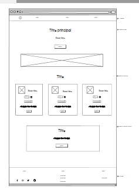
- Programme : 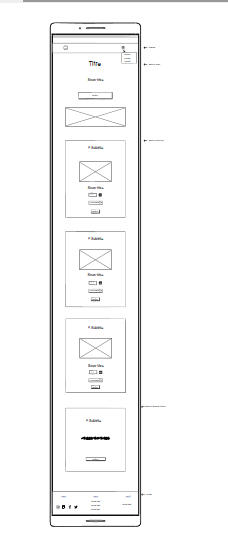
 Contact : 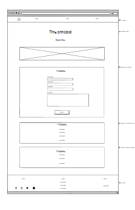
- Contact : 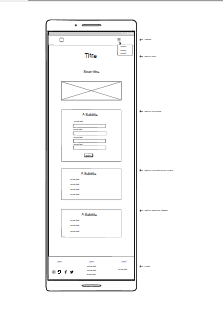

## ✅ Vérification de contraste

Exemple d’un test effectué avec WebAIM :

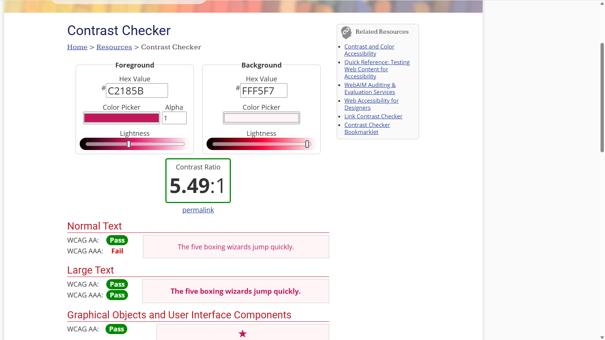

6. 🌟 Auteur et crédits
Auteur : Shadah
Crédits externes :
Images en format WebP (conversion locale)
Icônes via Bootstrap Icons
Polices via Google Fonts - Poppins

